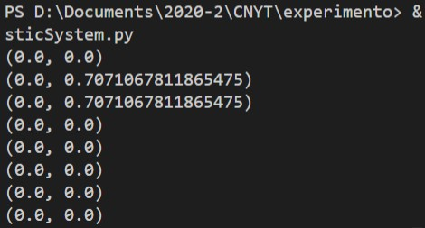

# Experimento de la doble rendija CNYT

# Descripción

En la física, una luz puede asemejarse a una onda, por lo que cuando este rayo láser de luz pasa a través de las dos rendijas, se convierte en dos ondas expandidas. Pero las ondas tienen este comportamiento que cuando se superponen, en algunas secciones (dependiendo de la posición de ambas) se cancelan. Y debido a eso, hace este efecto como si hubiera muchas rendijas que no existen. Esto tiene una explicación matemática más complicada, que para abreviar, la probabilidad resultante de dos números complejos puede ser cero, algo que no sucede sólo con los números reales.

Representación gráfica

# Justificación del efecto

Para esta demostración tenemos un láser que proyecta un haz de luz sobre una placa de papel aluminio con dos aperturas que representan doble rendija.

Los electrones  que conforman este haz de luz "teóricamente" tienen la misma posibilidad de pasar por alguna de las dos rendijas, 
pero no puede pasar por las dos simultaneamente. De acuerdo a este estado inicial tenemos que:

Los electrones van a pasar por una de las dos rendijas y se reflejaran en la pared en forma simétrica. Como tenemos dos rendijas, se van a formar dos grupos uniformes, uno a la derecha y uno a la izquierda. Cada grupo en frente de una rendija.Pero si revisamos el resultado del experimento, nos damos cuenta que esto no pasa. ¿A que se debe el extraño efecto?

Una posible opción es que los electrones después de pasar por la rendija no salgan disparados en línea recta, es decir, pueden cambiar su dirección e impactar en cualquier parte de la pared. Pero esto solo ocurriría si algo o alguien afectara su trayectoria. Ya que por la naturaleza del experimento los electrones van a mantener si dirección.

Aquí es donde entra la Física cuántica a explicar este fenómeno. Hoy en día, la teoría más aceptada por el mundo científico es que el "elemento" u "objeto" que está afectando ese electrón y haciendo que este cambie su tracyectoria, es una historia diferente de esta partícula, es decir, una historia diferente de la partícula que pertenece a otro universo; afecta la trayectoria de nuestra partícula original generando una acumulación de pepas uniforme(mejor visto como una línea de pepas ) sobre la pared.

Esta teoría abre la posbilidad de hablar del multiverso, en donde las partículas que están en nuestro universo tiene diferentes historias de ellas misma pertenecientes a otros universos, y que entre ellas pueden afectarse.

# Explicación matemática (Librería cuantica)

* [Código fuente de la libreria en Python3](https://github.com/JohanS11/ComplexCalculator)

## Mátriz utilizada para experimento con números reales

  
  
### Resultado despues de n clicks

**t = 1**

#### Probabilidades calculadas

* P(X1) = 1/2
* P(X2) = 1/2
* P(X3) = 0
* P(X4) = 0
* P(X5) = 0
* P(X6) = 0
* P(X7) = 0
* P(X8) = 0

### Resultado despues de n clicks

**t = 4**

#### Probabilidades calculadas

* P(X1) = 0
* P(X2) = 0,16666666
* P(X3) = 0
* P(X4) = 0,22222
* P(X5) = 0,38888
* P(X6) = 0,1666666
* P(X7) = 0,1666666
* P(X8) = 0,1666666

## Mátriz utilizada para experimento con números complejos

 
  
### Resultado despues de n clicks

**t = 1**

#### Probabilidades calculadas

* P(X1) = 0
* P(X2) = 0,70710678
* P(X3) = 0,70710678
* P(X4) = 0
* P(X5) = 0
* P(X6) = 0
* P(X7) = 0
* P(X8) = 0

### Resultado despues de n clicks

**t = 4**

### Justificación

Gracias al experimento realizado anteriormente con nuestra librería cuántica podemos inferir que despues de varios clicks, en el sistema comienza a aparecer el concepto de "interferencia" ya que los  fotones de luz no viajan a dos lados solamente, por el contrario, se dispersan en múltiples puntos.La explicación está basada en la teoría de los multiversos.

# Montaje

## Evidencias

**Materiales**

- Laser
- Mina 0.5

## Video del experimento

https://youtu.be/Lu7Gh_akJpI

# Integrantes

* Johan Sebastian Arias [JohanS11](https://github.com/JohanS11)

 
  

